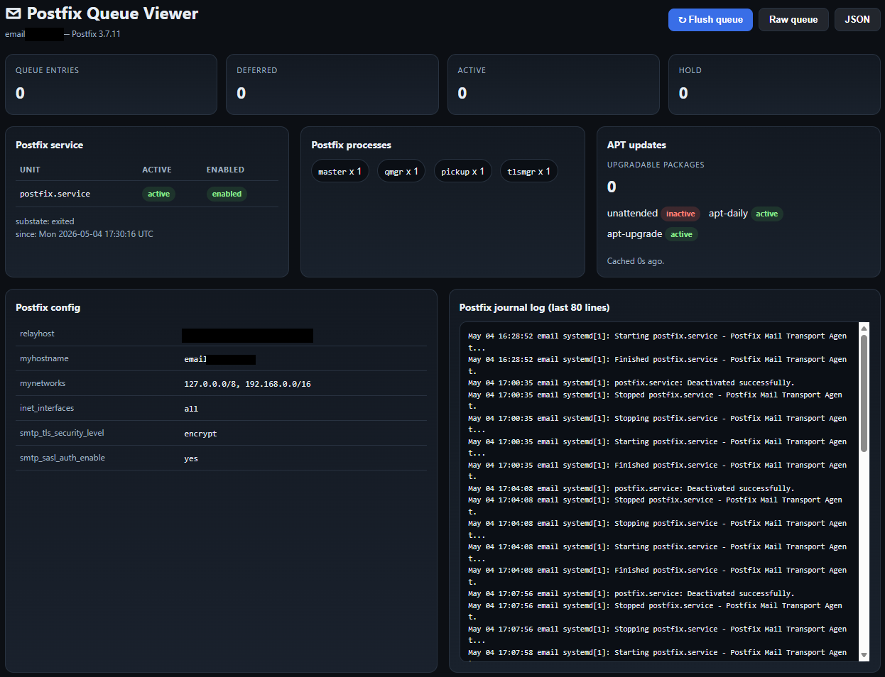

*Background:*
I am using Postfix for mail delivery on some of my relay/gateway hosts, and I wanted a simple way to check the live queue status without logging in and running `postqueue -p` or setting up a full monitoring stack. My Postfix run on a LXC container, so I don't have access to more advanced monitoring tools that might be available on a full VM or physical host. My Internal apps are using this Postfix instance as a relay, so I just need a quick way to see if mail is flowing and troubleshoot any stuck messages.

If you are curious my setup : 
- Postfix running in a Proxmox LXC container
- Postfix configured as a relay for internal applications, forwarding to an external SMTP provider (Brevo)
- I configure my self-hosted services to send mail through this Postfix relay, so I can centralize mail delivery and avoid exposing SMTP credentials in multiple places.
- The LXC is very small : 256MB RAM, 1 vCPU, and it runs a minimal Debian image with just Postfix and this viewer script.


# Postfix UI

A lightweight HTTP viewer for Postfix queue status, built for relay or gateway hosts that need a simple browser view of the live queue without a full monitoring stack.

The application reads real data from Postfix and systemd tools:
- `postqueue -j` for queue entries when available, with fallback to `mailq` text parsing on older setups.
- `postconf` for live Postfix configuration values such as `relayhost`, `myhostname`, and SMTP TLS/SASL settings.
- `journalctl` for recent Postfix service logs on systemd-based hosts.

## Screenshot



## Features

- Live queue counters: total, deferred, active, and hold.
- Queue entry table with sender, recipient, state, and delay reason.
- Raw queue endpoint and JSON endpoint for troubleshooting or automation.
- Queue flush action and queue-item deletion by ID.
- Configuration is read from Postfix at runtime.
- Postfix service status and recent logs displayed for quick troubleshooting.
- APT update status check to monitor if the system is up to date.

## Requirements

- Linux host running Postfix.
- Python 3.
- systemd and `journalctl` for the log view.
- Permission to run `postqueue`, `postsuper`, and `postconf`.

## Installation

Copy the script to the server:

```bash
install -m 0755 postfix-queue-viewer.py /usr/local/bin/postfix-queue-viewer.py
```

Test it manually first:

```bash
/usr/local/bin/postfix-queue-viewer.py
```

By default it listens on `0.0.0.0:8080`. You can override that with environment variables:

```bash
HOST=127.0.0.1 PORT=8080 JOURNAL_LINES=100 /usr/local/bin/postfix-queue-viewer.py
```

## systemd service

Create `/etc/systemd/system/postfix-queue-viewer.service`:

```ini
[Unit]
Description=Postfix Queue Viewer
After=network.target

[Service]
Type=simple
ExecStart=/usr/bin/python3 /usr/local/bin/postfix-queue-viewer.py
Restart=always
RestartSec=2
Environment=HOST=0.0.0.0
Environment=PORT=8080
Environment=JOURNAL_LINES=80

[Install]
WantedBy=multi-user.target
```

Enable and start it:

```bash
systemctl daemon-reload
systemctl enable --now postfix-queue-viewer.service
```

Check status and logs:

```bash
systemctl status postfix-queue-viewer.service --no-pager
journalctl -u postfix-queue-viewer.service -n 50 --no-pager
```

Restart after updating the script:

```bash
systemctl restart postfix-queue-viewer.service
```

If you change the unit file itself, reload systemd first:

```bash
systemctl daemon-reload
systemctl restart postfix-queue-viewer.service
```

## Permissions

The viewer needs access to Postfix commands. Running the service as `root` is the simplest approach for internal admin use because `postqueue` and especially `postsuper` typically require elevated privileges for flush and delete actions.

For a more restricted setup, grant only the commands you need through `sudoers` and adapt `ExecStart` or the script accordingly. `postconf` reads configuration values, while queue inspection and deletion are the more privileged operations.

## Endpoints

- `/` — HTML queue view.
- `/json` — JSON queue output.
- `/raw` — raw `postqueue -p` output.

## Security notes

There is no authentication or encryption in this simple viewer. It is intended for internal use on trusted networks or via secure tunnels. Do not expose it directly to the internet without additional protections.

## License

Free to use and modify as needed. No warranty or support provided.

## Author

Yoo 